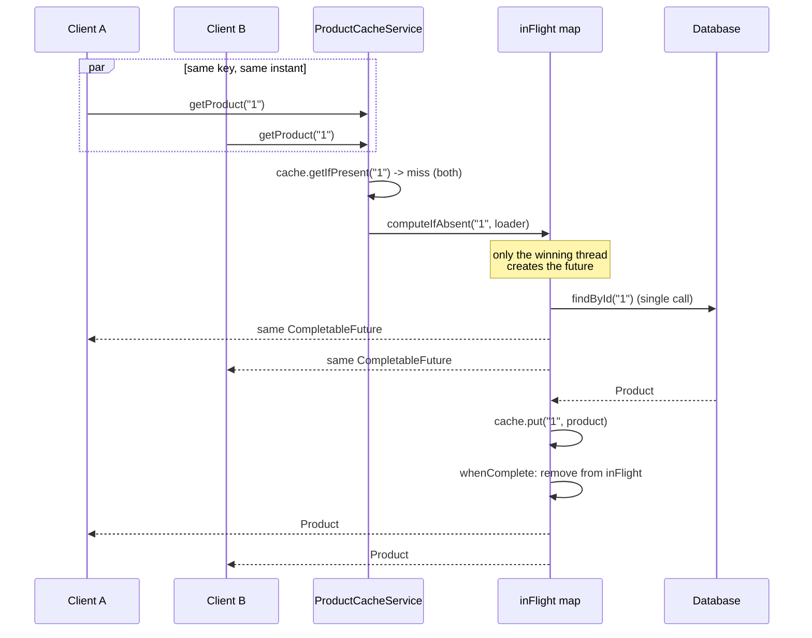

# Cache Coalescing Demo

A small Spring Boot service showing how to stop a "cold" cache key from causing
a thundering herd against your database — the pattern from the video.

It combines three things:

1. **Local in-memory cache** — [Caffeine](https://github.com/ben-manes/caffeine)
2. **Request coalescing / single-flight** — `ConcurrentHashMap<String, CompletableFuture<T>>`
   so concurrent callers for the same key share one in-flight load instead of firing N
   duplicate database calls
3. **Timeout protection** — `CompletableFuture.orTimeout(...)` so a slow/stuck load can't
   hang every caller waiting on it forever

▶ **[Play with an interactive simulation](https://claude.ai/code/artifact/9a91a421-f1e7-476a-bc11-f86b930c507e)** —
fire concurrent requests, toggle a slow database, and watch them coalesce onto one call live,
with a trace against the real source.

## Run

Requires Java 17+ and Gradle 8.14+.

```bash
gradle wrapper --gradle-version 8.14.4
./gradlew test
./gradlew bootRun
```

## Try it

First request hits the simulated database:

```bash
curl http://localhost:8081/api/products/1
```

Second request is served by Caffeine:

```bash
curl http://localhost:8081/api/products/1
```

Stats:

```bash
curl http://localhost:8081/api/stats
```

## Request coalescing demo

Clear the cache, reset the DB counter and fire 100 concurrent requests for the same key:

```bash
./scripts/load-test.sh 100 100
```

Expected behavior: roughly one database call, not 100.

## Timeout demo

Change `demo.database.delay-ms` to 3000 while keeping `timeout-ms` at 1500, restart, and call:

```bash
curl -i http://localhost:8081/api/products/1
```

Important: `CompletableFuture.orTimeout()` limits completion of the future. For real JDBC, also
configure a database/query timeout and a bounded connection pool; it does not magically cancel
arbitrary blocking work.

## Approach

The problem: when a cache entry expires (or never existed) and many concurrent requests ask for
the same key at once, a naive cache ("miss? go hit the DB") lets every one of those requests
through to the database at the same time — a thundering herd / dog-pile.

`ProductCacheService` avoids that with a two-level check:

1. **Fast path** — `cache.getIfPresent(id)`. If present, return immediately. No locking, no
   coordination, just a Caffeine lookup.
2. **Slow path (coalescing)** — on a miss, instead of every thread independently querying the
   repository, threads race on `inFlight.computeIfAbsent(id, ...)`. Only the thread that wins the
   race actually starts the DB load and wraps it in a `CompletableFuture`; every other thread
   asking for the same key in that window gets *the same future* handed back and simply waits on
   it. When the future completes, `whenComplete` removes it from the in-flight map so the next
   miss for that key starts a fresh load.
3. **Bounded wait** — the future is wrapped with `.orTimeout(timeoutMs, MILLISECONDS)` so a slow
   backend degrades into a timeout for all waiting callers instead of hanging them indefinitely. A
   failed/timed-out load is also actively invalidated from the cache so a bad result never gets
   served as a "hit".



```text
             HTTP REQUEST
                   |
                   v
            +-------------+
            | Caffeine L1 |
            +------+------+
                   |
             cache miss
                   |
                   v
      +---------------------------+
      | ConcurrentHashMap         |
      | key -> CompletableFuture  |
      +-------------+-------------+
                    |
                    v
              ONE DB REQUEST
                    |
                 timeout
                    |
                    v
                   DB
```

## Important limitation

The in-flight map and cache are local to one JVM. With multiple Spring Boot instances, each JVM
has its own cache and coalescing state — a request for the same key on two different instances
still results in two DB calls. That's the natural next step for a distributed-cache/Redis version
(e.g. a Redis-backed lock or a distributed single-flight implementation).

## Resources

- [Caffeine](https://github.com/ben-manes/caffeine) — the local cache used here
- [`CompletableFuture` Javadoc](https://docs.oracle.com/en/java/javase/17/docs/api/java.base/java/util/concurrent/CompletableFuture.html)
- [golang.org/x/sync/singleflight](https://pkg.go.dev/golang.org/x/sync/singleflight) — the
  canonical "single-flight" pattern this coalescing logic mirrors, from the Go ecosystem
- [Baeldung: Guide to Caffeine](https://www.baeldung.com/java-caching-caffeine)
